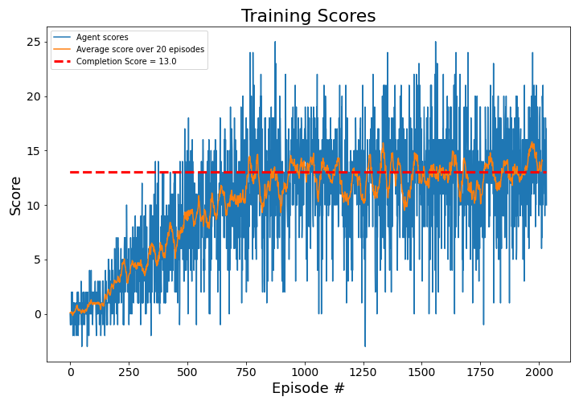

# Project 1 Navigation using Double Deep Q-Network Implementation
The goal of this project was to design a Reinforcement Learning (RL) based agent that could navigate a closed space to collect yellow bananas while avoiding blue bananas. The environment is based on the Unity-ML Agents Banana Collector Environment. The agent for this project was originally a Deep Q-Network (DQN) model. However, the learning rate was unsatisfactory with DQN, so the agent was modified into a Double Deep Q-Network (DDQN) model which greatly reduced training time. Both models are discussed in Section 1. Section 2 discussed the hyperparameters available, and which values were chosen. Section 3 shows the resutls of training, and compares the DQN to the DDQN model. Section 4 contains the conclusion and recommendation for future work.

# I. Agent Architecture
The original (DQN) model was revolutionary because it was able to train and play Atari games with exceptional skill, as discussed in the paper [Playing Atari with Deep Reinforcement Learning](https://arxiv.org/pdf/1312.5602). 
talk about DQN architecture, math equations, etc.
The problem is to find the optimal action-value function, from which one can define the policy that maximizes the return for each state. From [1], it is defined as $`q^*`$ for a state action pair $(s,a)$ provided by the optimal policy $\pi$ such that(pg 258 and pg 260):  
  
$`$q^*(s,a) = \text{max}_{\pi} \mathbb{E}_{\pi} \left[G_t | S_t = s, A_t = a\right]\,\,  \forall s \in S, \forall a \in A(s)$`$  
  
That is, the optimal policy $\pi$ will maximize the expected return $G_t$ of $`q^*`$ over the state space $S$ and action space $A$. $G_t$ is the discounted return, defined as:  
  
$G_t = R_{t+1} + \gamma R_{t+2} + \gamma^2 R_{t+3} + ... + \gamma^{T-1} R_T $  
  
The $R$ terms are the return from each time step, from t+1 to T. Future returns are weighted by $\gamma$, the discount factor because future returns as less useful than returns in the current state for making decisions. Additionally, future returns have higher variance because they are known with less certainty than the return the agent recently received. We can estimate the optimal policy using nonlinear function approximation AKA a neural network.  

## Defining a Q-Learning Target

There are several ways to estimate $`q^*`$ which is the "target" for Q-Learning. This project will use the Temporal Difference (TD) Target because it is commonly used and often has success. As the agent steps throught the environment, it gets rewards for taking actions. The TD method combines the reward from the next state action pair with the discounted future reward. There is a temporal difference between the current reward and the future rewards. Over time, as the Q-function is updated, the estimated future reward should converge to the actual reward value. The TD method uses an off-policy target that approximates a greedy policy because it always chooses the maximizing action. Off-policy indicates that the agent might not always choose the greedy action depending on the exploration/exploitation parameter $\epsilon$ discussed in Section II. From [1], the TD-Target is formulated as:  
  
$`$y_i = R_{t+1} + \gamma \text{max}_{a} \left[Q(S_{t+1}, a; \theta_i)\right]$`$  
  
where $`\theta_i`$ are the weights of the neural network used to parameterize Q for each layer i, and $S_{t+1}$ is the next state, and $a$ is the action that maximizes the return in the next state. 
Thus we can estimate the unknown function $`q^*`$ with the Q-Learning TD target:  
  
$`$q^*(s,a) \approx \text{max}_{\pi} \mathbb{E}_{\pi} \left[r + \gamma \text{ max}_{a^{'}}\,Q^*(s^{'}, a^{'})\right]$`$  
  
The $s'$ and $a'$ indicate they are the state and action from the next time step respetively.  

## Updating the Network

The network is updated gradually to minimize the expected error between the true optimal action-value function $`$q^*$`$  and the  neural network estimated action-value function Q. The error is calcluated using a Mean Squared Error loss function $L_i(\theta_i)$:  
  
$L_i(\theta_i) = \mathbb{E}_{s, a} [(q^* (s,a) - Q(s,a; \theta_i))^2]$  

Substitue the TD Target for $`q^*`$ into the loss function:  
  
$`$L_i(\theta_i) = \mathbb{E}_{s, a}[(r + \gamma \text{ max}_{a^{'}} \,Q^*(s^{'}, a^{'}) - Q(s,a; \theta_i))^2]$`$  
  
and take the gradient of $L$ with respect to the weights $\theta_i$ to obtain the network update function/objective function:  
  
$`$\nabla L(\theta_i) = \mathbb{E}_{s,a,r,s^{'}} \left[(r + \gamma \text{max}_{a^{'}} Q(s^{'}, a^{'}; \theta_i) - Q(s, a; \theta_i)) \nabla_{\theta_i} Q(s, a; \theta_i)  )\right]$`$  
  
The DQN algorithm uses a copy of the network that is updated less frequently as a represenentation of the Target (the offline network), and a copy that is updated every step the agent takes which represents the current estimate of the action-value function (the online network).
To update the offline network, the agent takes several steps to create a mini-batch of samples. The size of the mini-batch is a hyperparameter discussed in Section III. After a set number of steps, the algorithm computes the error between the offline TD Target network and the online network and updates the offline network weights to minimize the error. Mini-batches are important because updating after every step would have high varaince, and make it difficult for the network to converge on a solution as the target would always move. The steps are also assumed to be from a stationary,  Independent Identically Distributed (IID)  distribution. The samples cannot be taken from a distribution that is changing, and the samples are assumed to be independent from each other yet taken from an identical distribution. A mini-batch approach helps to re-create that assumption since there are multiple steps taken before the offline network gets updated and changes the sampled distribution.  
The update function is updated to reflect the delay in the Target network:  

$`$\nabla L(\theta_i) = \mathbb{E}_{s,a,r,s^{'}} \left[(r + \gamma \text{max}_{a^{'}} Q(s^{'}, a^{'}; \theta^{-}) - Q(s, a; \theta_i)) \nabla_{\theta_i} Q(s, a; \theta_i)  )\right]$`$  

where we now take the maximizing action from the Target network, indicated by $\theta^{-}$.  
  
The weights are updated using the Adam function, which uses and Adaptive Momentum update rule. It is adaptive because it changes the size of the update step based on the size of the gradient. It uses momentum to help get the gradient out of local minima and hopefully encourages the network to converge to the global mininum. Adam also uses a hyperparmeter $\alpha$ which controls how quickly the updated weights are applied to the network. It helps ensure the network eventually converges to the optimal solution as the number of samples goes to infinity. The learning rate must decay with time.

## Neural Network Design
The neural network models the Q-Function, which maps states and actions to an expected reward value. Rather than provide the action with the state, the network gives a value to each action and the agent can choose between them. The network has an input plane of 37 nodes representing the 37 input states, and an ouput plane of 4 nodes which provides an action value for each possible action (up, down, right, left). I decided to use 2 fully connected hidden layers with 64 nodes each. That seemed like a reasonable trade-off between network flexibility and size in memory.

# II. Improvements to  DQN  
The basic DQN is a good place to start, but it did not converge to a solution quickly for this project. To improve it, I added an Experience Replay Buffer (or Replay Buffer) and changed the algorithm to Double DQN. The Replay Buffer stores a number of previous experiences for the agent to resample so it can learn from them again. Double DQN helps prevent maximization bias. Both concepts are discussed further below.
## Experience Replay Buffer
A replay buffer is a memory bank of previous experiences, stored so the network can resample the experiences for an update. The buffer provides a larger sample of experiences to chose from each update step, rather than the select few the agent has encountered at the end of an episode. It is beneficial for agent to revisit past experiences because it can often learn more from the same experience. Additionally, the experiences are taken from diverse parts of the state space, so they are more indepenently sampled and less correlated. Finally, the replay buffer helps ensure the Q-Target is slowly moving so the agent can update better with less risk of diverging. The size of the replay buffer is controlled by a hyperparameter.
## Double Deep Q-Network
The basic Q-Learning approach has a tendency to bias towards positive rewards, which isn't always the correct value for a given state. This occurs because the agent chooses the maximum estimated reward even if the true reward value should be near 0 or negative.
Double Q-Learning solves this problem by having two Q-tables, $Q_a$ and $Q_b$. The algorithm makes a random choice between $Q_a$ and $Q_b$ to find the maximum action value for the given state. But the value assigned to that action comes from the other Q-table! In this way, both tables prevent each other from giving a biased estimate.  

For DDQN, the Target network and the online network work well as separate networks to use for Double Q-Learning. In practice, the online network is used to find the index of the best action. Then the Target network is used to evaluate the value for that action. The Target network is updated less frequently, so it gives more stable value estimates. The update rule changes as thus:   
  
$`$\nabla L(\theta_i) = \mathbb{E}_{s,a,r,s^{'}} \left[(r + \gamma Q(s^{'}, \text{argmax}_{a^{'}} Q(s^{'}, a^{'}; \theta_i); \theta^{-}) - Q(s, a; \theta_i)) \nabla_{\theta_i} Q(s, a; \theta_i)  )\right]$`$  

Note that the TD target is now evaluated by finding the argument (AKA index) of the maximizing action given by online network. Then, that action is provided to the Target network to get an estimate of the value for the current state and the chosen action. This value is used to update the online network.
## Continuous Network Updates
The target network was designed to be stationary so the network weights could converge to something stable before the weights were updated with new information. However, the target network goes stale as new information is discovered and the local network is updated. Additionally, making large changes to the target weights could disrupt the learning process and make it more difficultto converge. One solution is to use Polyak Averaging to continuously but gradually update the target network with weights from the local network. This concept is expressed in the equation:  

$\theta_{target} = \tau * \theta_{local} + (1 - \tau) * \theta_{target}$  

The hyperparameter $\tau$ controls the target network update rate. It allows the target network to lag behind the local network, but still incorporate new information.

# III. Hyperparameters
Below is a list of hyperparameters and a description of their purpose.  
  
Max Steps: the number of steps per episode before the agent is forced to stop if it doesn't reach the goal. If it is too small, the agent won't make progress learning. If it is too large, the agent might over fit the data because it's received examples that are less independent.  
**MAX STEPS = 500**  
$\alpha$: Learning Rate for the Adam optimizer. It controls how much of the reward update comes from the TD error, and how much comes from the received reward.  
**LEARN_RATE = 5e-4**  
$\gamma$: Discount factor for future rewards. Future rewards aren't know with high certainty, and they are less useful at the current state.  
**GAMMA = 0.99**  
Size of Replay Buffer: Controls how many samples are available for sampling to update the network.  
**BUFFER_SIZE = int(1e5)**  
Size of the batchs to fetch from the Replay Buffer: the number of samples in the mini-batch to update the network:  
**BATCH_SIZE = 32**  
After this many steps, update the target network  
**LEARN_EVERY = 5**  
$\tau$ : Parameter to control how much to update the target network with the local network. Bigger means it updates the target network with more of the local network. The value I chose is large (typically around 0.1) but it seems to learn relatively quickly and effectively.  
**TAU = 0.25**  
$\epsilon$ : exploration/exploitation parameter, larger values makes the network choose random actions more and explore the state space. Over time, $\epsilon$ decays to 0.01 which makes the network choose the action with the highest reward.  
**EPSILON = 0.999, decays to 0.01**

# IV. Training Results
Training Results from DQN  
  
The DQN model successfully trained the agent in 2847 episodes. The final score after 2947 episodes was 14.06.
  
Results from Double DQN  
  
The DDQN was more efficient, and was able to train the agent in 1933 episodes. The final score after 2033 episodes was 14.02.  

The DDQN agent was able to train the network in almost 1000 fewer episodes, which is a significant time savings!

# V. Conclusion and Future Work
There are further improvements on Double DQN that help the agent learn more efficiently from samples, which ultimately decreases the learning time. These improvements would be beneficial to incorporate in future projects.  

### Huber Loss ###  
In [1], Morales suggests an alternative loss function called the Huber Loss, which is a combination of Mean Squared Error (MSE) loss and Mean Abosolute Error (MAE) loss. Mean Squared Error Loss gives more weight to larger errors than small errors between the Target and the action value function. In supervised learning this philosophy holds because the true values are known from labeled data. For reinforcement learning, the agent is constantly adjusting the "truth" so it makes less sense to heavily penalize error since the truth we compare to is getting updated as well.

Mean Absolute Error, which takes the absolute value of the error between the TD Target and the action-value function. It is more resislient to outliers because it gives similar weighting to large and small errors, it is just a linear scale. This makes sense because the agent will be very wrong in the beginning as the agent starts to explore. However, MSE is advantageous over MAE in that the MSE gradients go to 0 as the loss goes to 0, which encourages the network to update less as the loss diminishes. Thereby the network should be more likely to stay in a minima and not overshoot.  

Huber loss is a combination of MSE and MAE; Near 0 it behaves like MSE and has a gentle gradient. Past a certain point, it turns linear like MAE so larger errors are not disproportionately penalized. It uses a hyperparameter, $\delta$, to control when the loss function becomes linear. $\delta = 0$ presents MAE, and $\delta = \inf$ presents MSE. A common choice is $\delta = 1$, but it requires tuning of several hyperparameters to find a value that works.

### Dueling DQN ###
Dueling DQN, another improvement, is presented in this paper: [Dueling Network Architectures for Deep Reinforcement Learning](https://arxiv.org/abs/1511.06581). which improves the agent's learning efficiency. The difference is the network will compute $q(s,a)$ by computing the value function $v(s)$ and the advantage function $a(s) = q(s,a) - v(s)$. The advantage function provides the extra value of chosing action $a$ over the default policy chosen for $v(s)$. Each state has some shared information about its value, characterized by $V(s)$. By computing $A(s)$ instead of $Q(s,a)$, we can extract more information from each sample because each sample will update the calculation for $V(s)$, which is common to all actions, and the specific *advantage* of choosing one action over the others. One way to implement it is to change the output of the neural network from 1 node per action to 1 node estimating $v(s)$, and 1 node per action representing $a(s,a)$. Then compute $q(s,a)$ as:  
  
$Q(s,a) = V(s) + A(s, a)$  
  
$`Q(s,a;\theta,\alpha,\beta) = V(s; \theta, \beta) + \left(A(s,a; \theta, \alpha) - \frac{1}{|A|} \sum_{a^{'}}\,\, A(s,a^{'}; \theta, \alpha)\right)$`$  
  
where $\theta$ is the network weights shared by $Q$, $V$, and $A$, $\beta$ are the network weights specific to $V$, and $\alpha$ are the weights specific to $A$. It is recommended to subtract the average advantage values from $A$ because the network really computes $Q$, the state-action value for each action. To transform the network outputs to $A$, the advantage function, subtract the mean of the advantages by a constant value each time the network runs. This should stabilize the optimization process.
Prioritized Replay
Other exploration strategies (greedy epsilon decay, exponential epsilon decay, softmax)

